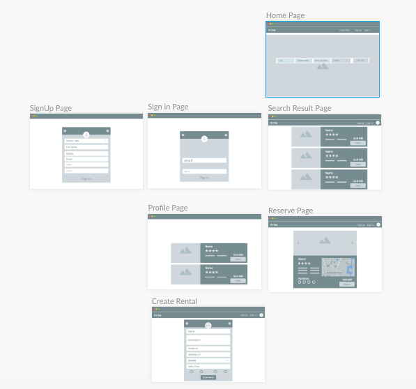

# onBay-p3

Description:
is a web application that allows a customer to search for a villa for dayley reservations.

Technologies and libraries:

Frontend:
react
react-ratings-declarative
react-map-gl
jwt-decode
axios

Backend:
express
mongoose
bcrypt
cors
multer
jsonwebtoken

Wireframes:

user stories:
- As a customer I would like to search for avilable villas.
- As a customer/owner I would like to register and login.
- As a customer I would like to rate and review villas.
- As an owner I would like to add new villas.
- As an owner I would like to edit/delete villas.
- As a customer I would like to book a villa.
- As a customer I would like to delete a booking.

Planning and development process:
- pre-project week work
  1. Brainstormed the main features of the website.
  2. Categorized the user types.
  3. Designed the website wireframes.
   
- project week work (members work)
  - Doaa
    - Backend ( the villa and bookings routes)
    - Linking of the backend with the frontend
    - Rate and reviews
  - Fahad
    - authintaction create React Components and routes
    -change password
    -edit profile
  - Nada
    - frontend
    - Image upload
